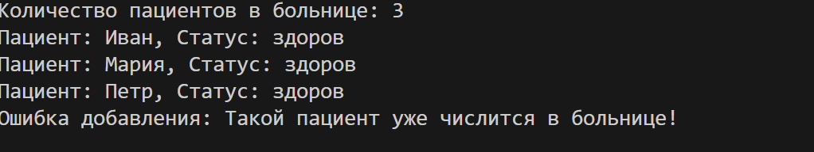
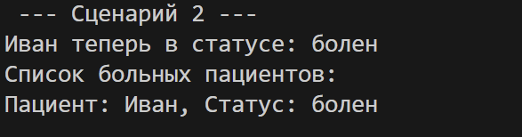
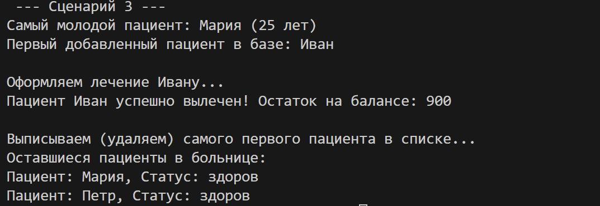

# Отчет по ЛР-2: Коллекция объектов

Реализован контейнерный класс `Hospital` (Больница) для управления множеством объектов «Пациент».

## Процесс и ответы на вопросы

### Вопрос 1. Что такое контейнер и чем он отличается от сущности?

**Сущность** (`Patient`) — это один человек с его именем и возрастом. А **контейнер** (`Hospital`) — это вся больница целиком.
Сущность просто хранит данные о себе, а контейнер управляет толпой таких сущностей: он знает, как добавить нового пациента, как найти нужного в списке или как кого-то выписать (удалить).

### Вопрос 2. Как обеспечена целостность данных в коллекции?

Чтобы в больнице был порядок, я добавил три уровня защиты:

1. **Проверка «свой-чужой»**: в метод `add()` встроена проверка. Если попытаться добавить вместо пациента что-то другое (например, просто строку), программа выдаст ошибку.
2. **Никаких двойников**: перед тем как добавить пациента, больница проверяет, нет ли там уже человека с таким же именем и возрастом.
3. **Защита от ошибок в номерах**: если мы удаляем кого-то по номеру (индексу), программа сначала проверяет, существует ли вообще такой номер, чтобы ничего не «сломалось».

### Вопрос 3. Как реализована итерация и доступ по индексу?

Я использовал специальные «магические» методы Python, чтобы с больницей можно было работать так же удобно, как с обычным списком:

- С помощью `__iter__` теперь можно просто написать `for patient in hospital` и перебрать всех людей.
- Благодаря `__len__` мы всегда можем узнать количество пациентов командой `len(hospital)`.
- Через `__getitem__` можно быстро достать пациента по его номеру в списке, например `hospital[0]`.

### Вопрос 4. Какие критерии поиска и фильтрации выбраны?

Для удобства работы в `Hospital` добавлены инструменты «умного» поиска:

- **Поиск**: можно найти человека просто по имени через `find_by_name`.
- **Фильтр**: можно одной командой вытащить список только больных или только здоровых пациентов.
- **Сортировка**: можно упорядочить всех пациентов по возрасту — от самых молодых до пожилых.

---

## Демонстрация работы

В `demo.py` реализованы три ключевых сценария использования системы.

### Сценарии в demo.py:

1. **Базовые операции и защита**: 
   - Создание больницы и добавление пациентов.
   - Проверка защиты от дубликатов (выброс исключения `ValueError`).
   - Проверка работы `len()` и итерации через `for`.

2. **Поиск и изменение состояния**:
   - Поиск конкретного пациента по имени.
   - Изменение его состояния (вызов метода `get_sick()`).
   - Получение списка всех больных пациентов в больнице.

3. **Продвинутое управление**:
   - Сортировка всей базы пациентов по возрасту.
   - Доступ к данным через индексы (`hospital[0]`).
   - Процесс лечения и последующая выписка (удаление) пациента из системы.

