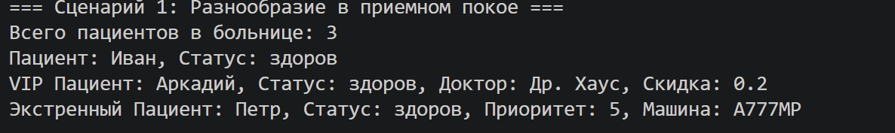
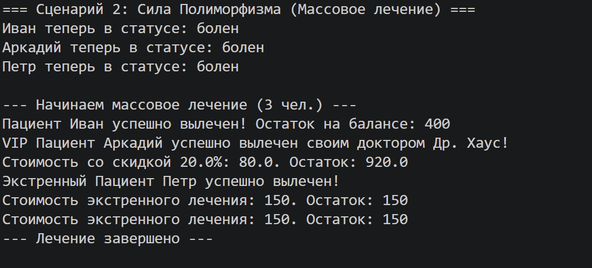
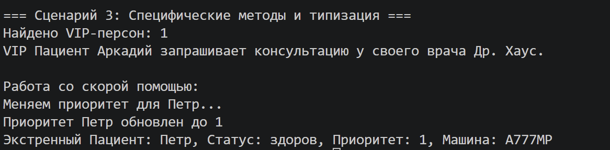

# Лабораторная работа №3: Наследование и Полиморфизм (Медицина)

## 1. Зачем всё это нужно?
Если в прошлых работах у нас были просто безликие пациенты, то теперь мы разделили их на группы. Цель проста: научиться создавать новые типы объектов на основе старых, чтобы не переписывать один и тот же код сто раз (наследование) и научить программу автоматически понимать, кого и как лечить (полиморфизм).

## 2. Кто есть кто в нашей больнице
Я создал «семейство» классов, где всё начинается с обычного человека:

1.  **Patient (Базовый класс)** — наш старый знакомый. Умеет болеть, лечиться за 100 монет и хранить имя с возрастом.
2.  **VIPPatient (Наследник)** — «элитный» пациент. 
    *   **Что нового**: у него есть свой личный врач и скидка на всё. 
    *   **В чем фишка**: он лечится дешевле, чем остальные.
3.  **EmergencyPatient (Наследник)** — пациент, которого привезла скорая.
    *   **Что нового**: у него есть уровень срочности (приоритет) и номер машины скорой помощи.
    *   **В чем фишка**: лечение стоит дороже (150 монет), потому что случай экстренный.

## 3. Магия Полиморфизма
В коде больницы (`Hospital`) есть метод `treat_all_sick()`. Самое классное здесь то, что нам не нужно писать: «если это VIP — делай так, если нет — делай иначе». 
Python сам смотрит на «паспорт» объекта. Если это VIP — сработает скидка, если экстренный — возьмется полная цена за срочность. Это и называется полиморфизмом: команда одна (`treat`), а результат разный.

## 4. Сценарии проверки (demo.py)
Я написал три ситуации:
1.  **Приемный покой**: показываю, что в одну больницу теперь можно класть людей разных типов.

2.  **Массовое лечение**: заставляю всех заболеть и лечу одной кнопкой. В консоли сразу видно, что с кого-то сняли 80 монет (VIP), а с кого-то 150 (скорая).

3.  **Личные фишки**: вызываю у VIP-пациента его линый метод (консультация своего врача), которого нет у обычных людей.

---

## Ответы на вопросы (для защиты)

### Вопрос 1. Чем отличаются «родитель» и «ребенок» (базовый и дочерний классы)?
Родитель (`Patient`) — это общая заготовка со всеми основными полями. Ребенок (`VIPPatient`) — это уточненная версия. Ребенок забирает всё хорошее у родителя, но добавляет свои детали.

### Вопрос 2. Что делает`super()`?
Это способ «позвонить родителям». Когда мы создаем VIP-пациента, мы не хотим заново писать код для проверки имени и возраста. Мы пишем `super().__init__`, и родительский класс делает эту скучную работу за нас.

### Вопрос 3. Что такое полиморфизм?
Это когда у тебя есть несколько разных кнопок с надписью «Пуск», и каждая запускает свой процесс, хотя нажимаешь ты их одинаково. В нашем случае кнопка — это метод `treat()`.
