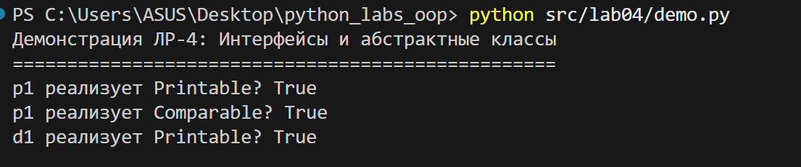
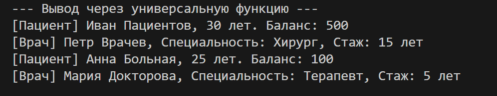
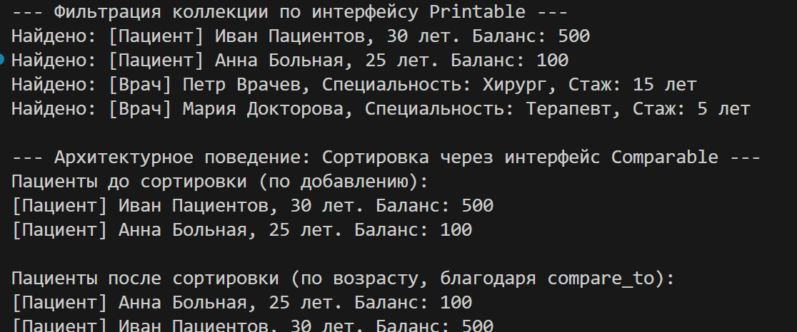

# Отчет по ЛР-4: Абстрактные базовые классы и интерфейсы

## 1. Цель работы
В ходе выполнения лабораторной работы были изучены:
*   Создание и использование **абстрактных базовых классов (ABC)**.
*   Реализация **интерфейсов** как контрактов поведения для объектов.
*   Применение **полиморфизма** через работу с объектами разных типов через единый интерфейс.
*   Использование функции `isinstance()` для проверки соответствия объекта интерфейсу.
*   Проектирование архитектуры на базе интерфейсов (сортировка и вывод).

---

## 2. Описание интерфейсов
В файле `interfaces.py` создано два интерфейса:
1.  **`Printable`**: требует реализации метода `to_string() -> str`. Предназначен для объектов, которые могут выводить информацию о себе в текстовом виде.
2.  **`Comparable`**: требует реализации метода `compare_to(other) -> int`. Предназначен для объектов, которые можно сравнивать между собой для последующей сортировки (возвращает -1, 0 или 1).

---

## 3. Реализация в классах
Оба интерфейса реализованы в двух разных классах (файл `models.py`):
1.  **`Patient` (Пациент)**:
    *   `to_string()`: выводит данные пациента (имя, возраст, баланс).
    *   `compare_to()`: сравнивает пациентов по их **возрасту** (`_age`).
2.  **`Doctor` (Врач)**:
    *   `to_string()`: выводит данные врача (имя, специальность, рабочий стаж).
    *   `compare_to()`: сравнивает врачей по их **опыту работы** (`_experience`).

Поведение методов кардинально отличается, что демонстрирует полиморфизм интерфейсов: один и тот же метод (`compare_to`) под капотом использует совершенно разные логические правила в зависимости от типа объекта.

---

## 4. Демонстрация
В файле `demo.py` реализованы следующие архитектурные сценарии:
1.  **Множественная реализация и `isinstance`**: Проверка, что объекты пациентов и врачей действительно считаются экземплярами `Printable` и `Comparable`.

2.  **Универсальная функция**: Функция `print_all(items: list[Printable])`, которая перебирает любые объекты (будь то врачи или пациенты) и вызывает у них `to_string()`, ничего не зная об их конкретных классах.

3.  **Интеграция с Коллекцией (Архитектурное поведение)**: 
    *   Добавление разных объектов (даже обычных строк) в коллекцию `HospitalCollection`.
    *   **Фильтрация**: Получение только тех объектов, которые поддерживают интерфейс `Printable` (строки отбрасываются).
    *   **Сортировка через интерфейс**: Архитектурная сортировка (пузырьком), которая вызывает метод `compare_to()`. В демонстрации показана успешная сортировка списка пациентов по их возрасту.

    

