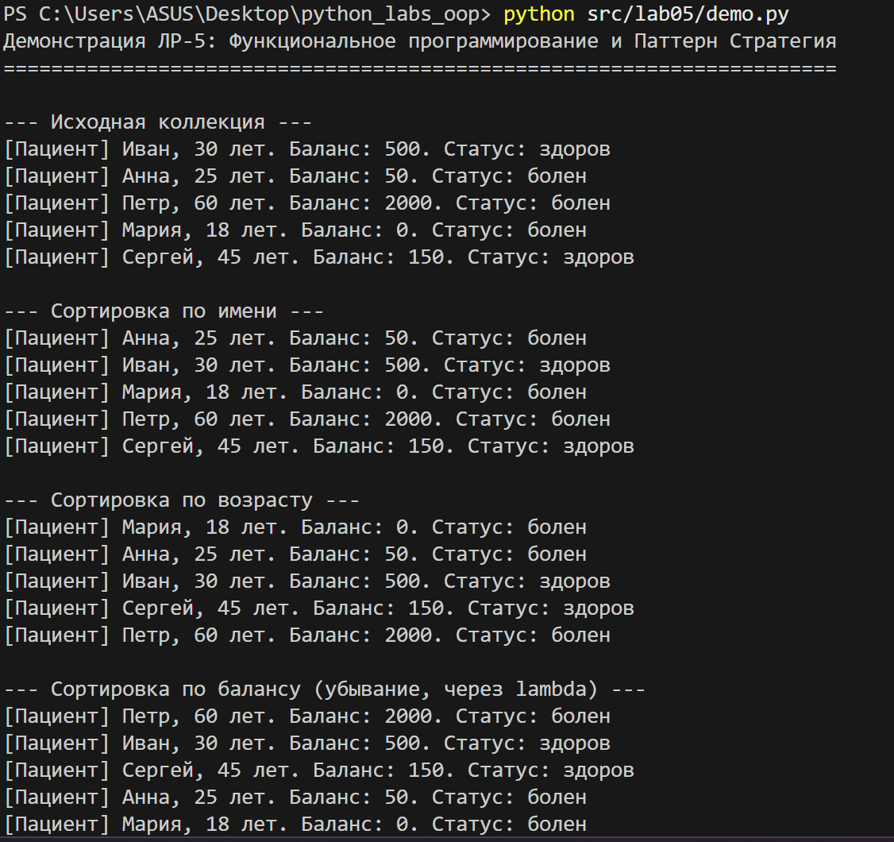
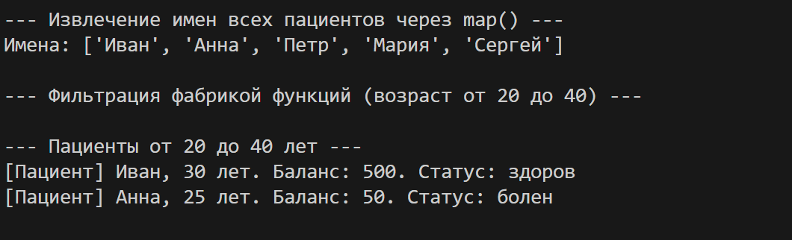
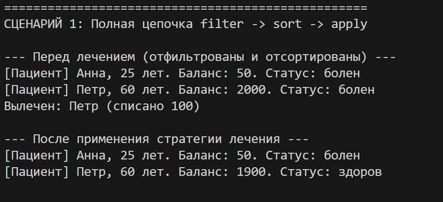
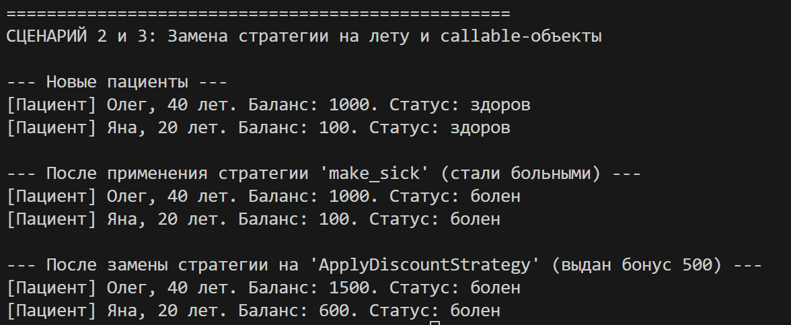

# Отчет по ЛР-5: Функциональное программирование и паттерн «Стратегия»

## 1. Цель работы
В ходе выполнения лабораторной работы были изучены:
*   Передача функций как аргументов в другие методы (функции высшего порядка)
*   Использование встроенных функций `map`, `filter`, `sorted`
*   Применение `lambda`-выражений для создания анонимных функций на лету
*   Реализация паттерна «Стратегия» для динамической подмены поведения (сортировка, фильтрация, обработка)
*   Создание фабрик функций (замыканий)
*   Построение цепочек вызовов (fluent interface) для обработки коллекций

---

## 2. Реализованные функции и стратегии
Все стратегии вынесены в отдельный файл `strategies.py`

### Функции-стратегии для сортировки
1.  `sort_by_name`: сортирует пациентов по имени
2.  `sort_by_age`: сортирует пациентов по возрасту
3.  `sort_by_balance_and_age`: сложная стратегия сортировки по нескольким полям

### Функции-фильтр
1.  `is_sick`: возвращает `True`, если статус пациента "болен"
2.  `is_solvent`: возвращает `True`, если у пациента положительный баланс

### Фабрика функций (Замыкание)
*   `make_age_filter(min_age, max_age)`: динамически создает и возвращает новую функцию, которая отсеивает пациентов по заданному возрастному диапазону

### Паттерн «Стратегия» и Callable-объекты (на оценку 5)
Вместо обычных функций созданы классы, реализующие магический метод `__call__`. Это позволяет стратегиям хранить внутри себя состояние (параметры)
*   `TreatStrategy(cost)`: стратегия лечения. Содержит параметр `cost` (стоимость). При вызове списывает деньги и меняет статус пациента на "здоров"
*   `ApplyDiscountStrategy(bonus_amount)`: стратегия пополнения баланса.

В классе `HospitalCollection` реализован метод `apply(func)`, который принимает любую из этих стратегий и прозрачно применяет её ко всем элементам

---

## 3. Демонстрация работы

### Сценарий 1: Полная цепочка операций (Chaining)
Выполнена последовательная цепочка:
1. Фильтрация только больных (`filter_by(is_sick)`)
2. Фильтрация только платежеспособных (`filter_by(is_solvent)`)
3. Сортировка по возрасту (`sort_by(sort_by_age)`)
4. Применение `callable`-стратегии лечения (`apply(treat_strategy)`)

 

### Сценарий 2: Замена стратегии
Показано, что метод `apply()` в коллекции может принимать совершенно разные стратегии. Сначала мы передаем обычную функцию `make_sick` (все становятся больными), а затем, не меняя код коллекции, передаем объект `ApplyDiscountStrategy`, который выдает всем бонусные деньги
### Сценарий 3: Использование встроенных функций и Lambda
*   Продемонстрировано использование встроенной функции `map` через метод `map_items()` с передачей `lambda`-выражения для извлечения только имен пациентов из объектов
*   Выполнена сортировка по убыванию баланса с использованием быстрого `lambda`-выражения
