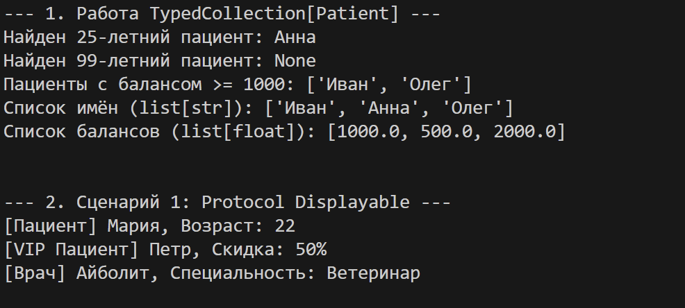
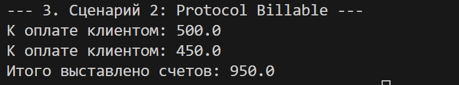

# Отчет по ЛР-6: Аннотации типов, обобщения (Generics) и структурная типизация (Protocol)

## 1. Цель работы
Изучить и применить статическую типизацию в Python с использованием встроенного модуля `typing`. На практике освоить создание параметризованных (Generic) классов, методы с динамически меняющимся типом возвращаемого значения (на основе параметров) и применение протоколов (`Protocol`) для реализации «утиной типизации» (структурной типизации) с проверкой типов.

---

## 2. Описание реализованных типов и контейнеров

В проекте произведено строгое типизирование всех компонентов.

### Доменные модели (`models.py`)
Все классы из предыдущих лабораторных (`Patient`, `VIPPatient`, `Doctor`) были полностью аннотированы:
*   Указаны типы принимаемых аргументов в конструкторах (`name: str`, `age: int` и т.д.).
*   Прописан тип возвращаемого значения `-> None` для конструкторов `__init__`.
*   Все методы явно указывают тип возвращаемых данных (например, `-> float` для `get_bill_amount`).

### Типизированная коллекция (`container.py`)
Был создан новый класс-контейнер `TypedCollection`, унаследованный от `Generic[T]`, где `T` — обычный обобщенный тип (`TypeVar`). 
Коллекция реализует следующие строго типизированные методы высшего порядка:
*   `find`: возвращает `Optional[T]` (найденный элемент или `None`).
*   `filter`: возвращает отфильтрованный список исходного типа `list[T]`.
*   `map`: принимает трансформирующую функцию и возвращает список нового типа `list[R]`, где `R` — второй `TypeVar`. Это позволяет превратить, например, список объектов пациентов в список строк с их именами.

### Структурная типизация (Protocol)
В файле `container.py` объявлены два протокола:
1.  **`Displayable`**: контракт на наличие метода `display() -> str`.
2.  **`Billable`**: контракт на наличие метода `get_bill_amount() -> float`.

Созданы ограниченные типы: `D = TypeVar('D', bound=Displayable)` и `B = TypeVar('B', bound=Billable)`.
Это позволяет создавать коллекции, которые принимают любые, даже не связанные наследованием классы, при условии, что у них есть нужные методы.

---

## 3. Демонстрация работы

В `demo.py` реализовано два основных блока:

### Часть 1: Базовая типизированная коллекция
Продемонстрировано добавление объектов `Patient` и его наследника `VIPPatient` в `TypedCollection[Patient]`. Успешно вызваны методы `find`, `filter` и `map`. Результат метода `map` наглядно показывает трансформацию списка объектов в списки базовых типов (`list[str]` и `list[float]`).

### Часть 2: Использование Protocol
*   **Сценарий 1 (Displayable)**: В `TypedCollection[Displayable]` успешно добавлены как пациенты (`Patient`, `VIPPatient`), так и совершенно сторонний класс `Doctor`. Они не объединены общим родителем, но все удовлетворяют протоколу `Displayable`.

*   **Сценарий 2 (Billable)**: В `TypedCollection[Billable]` добавлены пациенты (у них есть методы биллинга). Если попробовать добавить туда объект класса `Doctor`, статичный анализатор типов (IDE/mypy) выдаст ошибку, защищая нас от вызова несуществующего метода во время выполнения программы.

